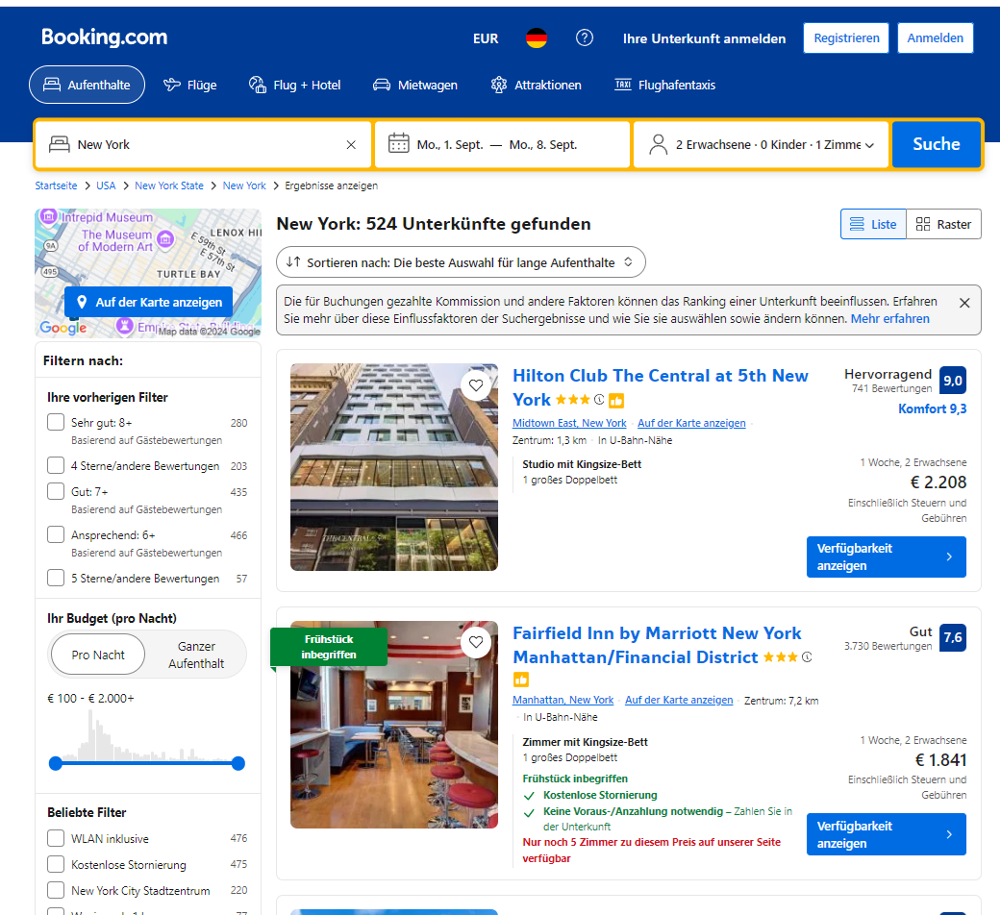
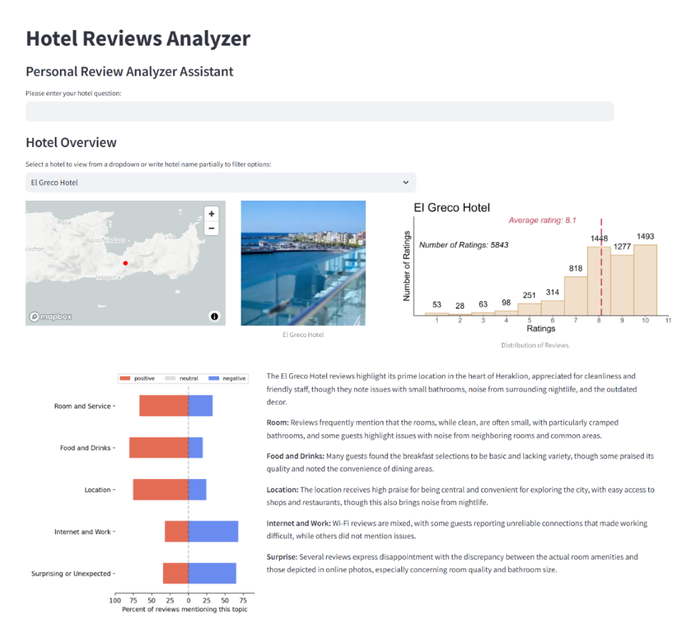

# Hotel Review Project

Booking.com is one of the largest online travel agencies and under the top 100 most visited websites of the world. Customers booked more than a billion (10^9) nights on Booking.com. Thus, improving aiding the booking and hotel choice procedure has the potential to benefit a huge number of customers.

This, or something similar, is what you see when you try to book a hotel on Booking.com.
The most important information people use when booking a hotel is the room price, followed by the customer rating.

.

Reviews play such an important role in booking a hotel because the past experience of hotel guests is usually a pretty good approximation of the experience of potential future guests--including you.
Thus, people are willing to pay quite a bit more for hotels with good scores (see literature: https://api.semanticscholar.org/CorpusID:54877756 or https://api.semanticscholar.org/CorpusID:203160926).
On the other hand, this also means that people pay too much for hotels whose scores do not reflect their true quality.

Here we developed a Streamlit app to better inform consumers what allows them to better judge the quality of the hotel by providing additional information about the ratings and reviews.

It has the following features:

1. Trend Detector: which identifies hotels that have deteriorating review scores by comparing average ratings with recency weighted averages.
2. A quantitative and qualitative overview of the hotels.
3. A RAG system allowing the customer to ask questions about a specific hotel (e.g., How is the internet connection?)

## How to use it

### OpenAI key

Create a file named `.env` in the root directory of this project and save your openai key there:

```plaintext
# .env
OPENAI_API_KEY=your_openai_api_key_here
```

The `.gitignore` file has `.env` included, thus it should be save. The api is used for the interaction with the RAG-system.

### Ollama model

llama3 is used to generate embeddings of the reviews and llama3.2 to categorize the reviews into specific categories.
Thus, you need to install Ollama on your computer and download these two models.

See:
https://ollama.com/

### Gather data

To gather the data for the app you need to run the notebook: `Scrape_and_analyse_data.ipynb`
The notebook does following steps:

1. Scrape the data from booking
2. Clean the reviews and translate spanish, german, french into english
3. Categorize reviews into topics
4. Summarize reviews of each hotel
5. Create a embedding database for a RAG system
6. Plotting and saving the rating summaries

### Streamlit app

The streamlit app looks like this:

.
